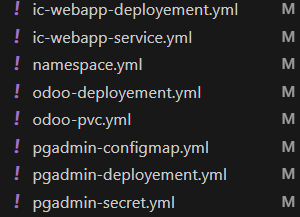
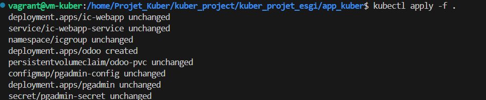

RAPPORT MINI PROJET

Rappel Contexte & Objectif :

Le but de ce petit projet était de mettre en place un site web vitrine accompagné de deux applications :
    - Oddo
    - PGAdmin

Dans un premier temps, on procède a une copie du dossier source avec git clone, puis on créer & rempli le DOCKERFILE, pour fournir le socle de la boîte automatique ou le site et ses applis vont être déployer.

Ensuite, pour déployer le site ainsi que ses outils de travail, on va utiliser la solution kuber pour mettre en place tout les services que demande le client.
On va créer le dossier "app_kuber" et on va ajouter les fichiers qui seront des pods de chaque service :

    - ic-webapp-deployement.yml
    - ic-webapp-service.yml
    - namespace.yml
    - odoo-deployement.yml
    - odoo-pvc.yml
    - pgadmin-configmap.yml
    - pgadmin-deployement.yml
    - pgadmin-secret.yml

Ensuite tous vont être configurer pour mettre en place le service web, par ailleurs il faut créer dans la racine un dossier pgadmin4 pour qu'il héberge le fichier servers.json du client.

On configure les fichier suivant :

ensuite pour déployer tout ces fichier on lance la commande suivante :
kubectl apply -f .

Ce qui donne ceci :

Si tout s'est bien dérouler vous devez arriver a obtenir les deux applications.

