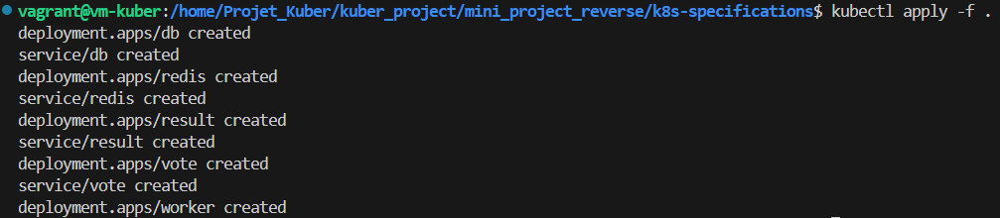
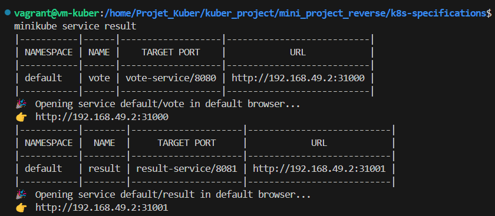

L'objectif de ce projet est de mettre en place l'application Voting APP en place.

Pour ceci nou utilisons les outils suivant :
    - Docker
    - Kubernetes
    - Minikube

A partir de notre machine, il faut configurer les différents pods ainsi que le dockerfile.

Après avoir configurer les fichier on exécute la commande suivante :

Pour exposer les services déployer on procède de la manière qui suit :

On met en place une connexion ssh :

Et maintenant on peux accéder a notre application.